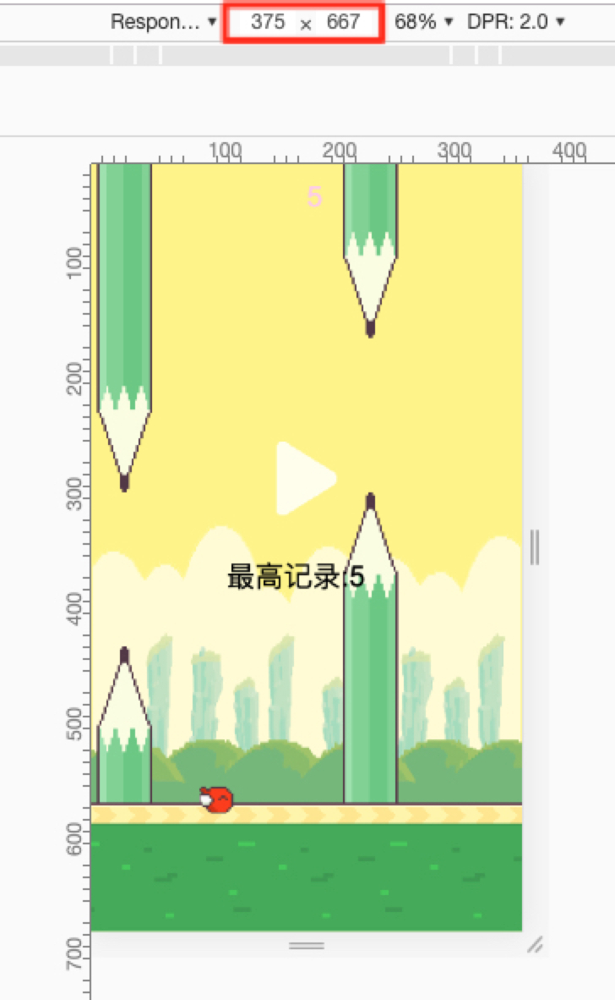

# canvas-game

**`live-server`** is a litte development server with live reload, so wo can review result when coding.

```bash
$ git clone https://github.com/Allen7D/canvas-game.git
$ cd mini-shop-server 
$ npm install -g live-server
$ live-server  # start server
```

<div style="text-align:center;">
    
</div>
